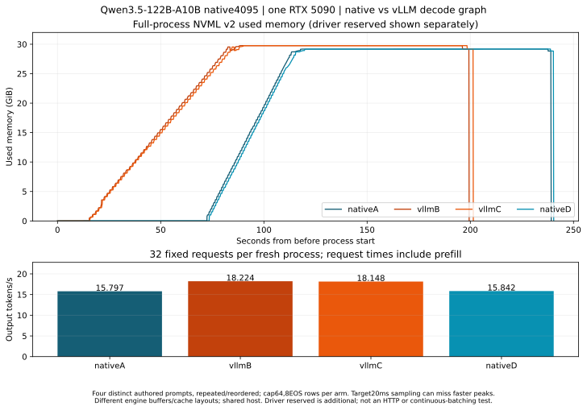
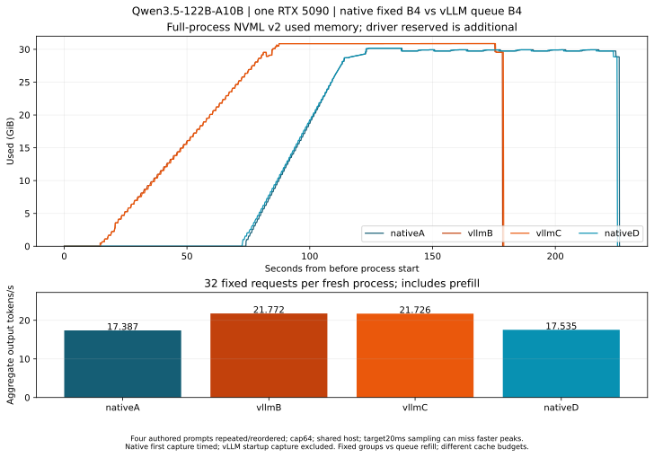
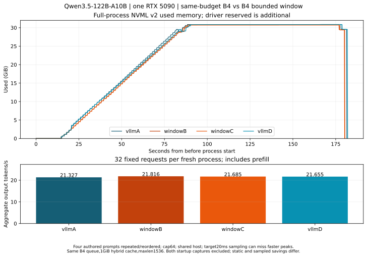
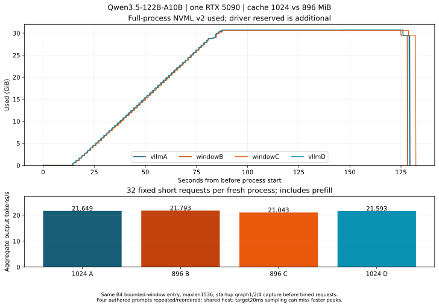
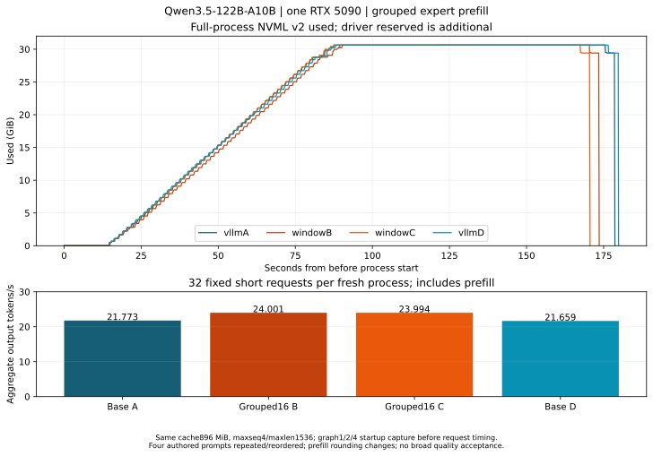

# 单张 RTX 5090 跑 122B：已验证的实验版

本目录保存 **Qwen3.5-122B-A10B** 的新旧两版自定义量化推理入口：48 层三值专家、非专家线性层与 embedding 4bit、rank-8 BF16 补偿。总参数约 122B，每 token 激活约 10B。这不是 122B 稠密模型，也不是完整 Bonsai 复现。

**旧版已完成量化、4096 步补偿训练与打包，能在单张 32GB RTX 5090 上生成。质量仍未通过验收：中文/格式 45/48，验收线 48；CMMLU 162/201，验收线 163。** 新的教师对齐产物 `native4095` 也已完成训练、导出回放、独立数值检查，以及直接使用本仓库入口的单卡测速和中文生成；结果分别记录。新版质量也未通过验收。

## 新一轮训练记录（2026-10-09）

新版本在单张 B300 上完成 4096 步、16,773,120 个监督位置。训练的是全部 48 层的 192 个 FP32 rank-8 补偿张量；三值专家、校准后的非专家 4bit 权重保持冻结，**不是全专家权重 QAT**。使用 OpenThoughts 的 4096 条训练块和 128 条验证块，每块 4096 token；原始 BF16 教师与学生均监督 4095 个位置，教师使用原始输出头，学生使用自己的 4bit 输出头。

128 条验证样本的平均 `KL + 0.1 × normalized-state-MSE` 从 0.16703349 降至 0.04561734，128/128 条均改善。全部 48 层已导出，重新加载 BF16 补偿后，128 条验证结果与导出前完全一致，训练进程正常退出。机器记录见 [native4095-training-result.json](native4095-training-result.json)。

截至 2026-10-09 19:08（北京时间），独立 B300 进程重新加载后，全部 128 条验证、524,160 个监督位置的结果与训练记录完全一致；另完成 768 个逐层和 16 个整模型缓存检查。单张 RTX 5090 上也已完成 768+16 个缓存检查，隐藏状态与缓存 logits 的相对误差均为 0，16/16 个缓存 argmax 相同；该次 512-token 预填充加 1-token 解码检查的峰值 CUDA allocated 为 30,498,338,816 字节。

新版四组公开开发评测和逐题原模型对照已全部完成：

| 评测 | 新版通过数 | 原生 BF16 通过数 | 总题数 |
|---|---:|---:|---:|
| 中文及格式 | 46 | 48 | 48 |
| CMMLU | 161 | 163 | 201 |
| GSM8K | 189 | 190 | 200 |
| HumanEval | 134 | 135 | 164 |

**四组均未达到原模型基线，质量未通过验收。** 保持原数据、生成上限、EOS 和评分规则；两个不支持的 HumanEval 样本仍计入 164。最终测试流程已按既定开发评测条件关闭，没有读取保留测试数据。训练损失改善、数值一致和解码速度不能替代能力验收。完整汇总 SHA 和逐题结果分类计数见训练记录 JSON。

`infer.py` 默认保留旧版；使用 `--artifact-version native4095` 加载新版。两版均校验各自固定的 manifest SHA。新版本训练入口还在整理：除补偿训练脚本外，还需提供原始专家三值拟合、非专家 4bit 校准和匹配的教师目标生成流程，尚未发布可从原始模型开始的一键训练入口。

## 文件与运行环境

第一版原生推理从 `infer.py` 读起，其路径保留25个依赖模块，移除了训练、集群调度与评测入口。后续vLLM及吞吐优化增加的入口和模块在本文后续章节及各自源码清单中记录。数值计算语句与原实验 AST 一致，来源记录在 `runtime-provenance.json`。保留这些模块是为了维持舍入、路由、缓存与内存释放顺序。

环境为 Linux、Python 3.12、Torch 2.11.0+cu130、Transformers 5.12.1、Triton。还需使用原环境的 `causal_conv1d` CUDA 扩展；缺少或替换实际卷积后端会改变计算。本目录没有修改系统包或自动安装 CUDA 扩展。模块对部分 Transformers 源码带 SHA 校验，版本或代码不一致时会拒绝运行。

模型权重不放进 Git。需要另行提供**所选版本已经打包好的实验模型目录**，包含配置、tokenizer、`summary.json`、`retained.pt`、embedding 和全部专家/dense bank 文件。原始 Hugging Face BF16 权重不能直接传给这个入口。本仓库目前没有从原始 122B 权重训练出该产物的一键流程；122B 的最小训练代码仍待完整验证。

旧版（默认 `--artifact-version old`）manifest SHA256：

```text
5c9683297d71c1dbdd1c32a8a749aa1911c857fb9ef1a788dfe794230abd08a9
```

新版（`--artifact-version native4095`）manifest SHA256：

```text
dc3a9ba1a8bd9bcdd229b3c259cc5d676719861946a5ed2d90b39ac2e196def1
```

加载前逐文件校验 SHA；不需要实验机器的原目录、SSH 或旧调度日志。这里只验证文件身份与推理，不把去掉内部调度依赖解释为质量验收。

```bash
# 在已安装上述依赖的 Linux GPU 环境中运行。
CUDA_VISIBLE_DEVICES=0 python experimental122/infer.py \
  --model models/qwen35-122b-experimental-packed \
  --prompt '用中文解释什么是模型量化。' --max-new-tokens 128 \
  --output outputs/122b-generation.json

# 与原记录相同的五种上下文、固定 64-token Graph/静态对照。
CUDA_VISIBLE_DEVICES=0 python experimental122/infer.py \
  --model models/qwen35-122b-experimental-packed --benchmark \
  --output outputs/122b-benchmark.json
```

生成入口按 EOS 停止。测速入口固定执行 64 步，即使遇到 EOS 也继续，以对齐原来的工程记录；它排除提示词处理与 Graph 录制。单请求文本推理，无 CPU 权重卸载；没有并发服务、vLLM 插件或视觉推理支持。

## 已有实测

| 上下文 token | 解码 tokens/s | 峰值 CUDA allocated 字节 |
|---|---:|---:|
| 128 | 28.44 | 30,486,048,256 |
| 512 | 28.34 | 30,530,485,248 |
| 4096 | 25.56 | 31,042,519,552 |
| 8192 | 22.72 | 31,369,777,664 |
| 16384 | 18.81 | 32,494,375,424 |

全部五种上下文的 Graph/静态 64-token 输出逐位一致。文字模型去重后的 CUDA 权重/缓冲存储为 30,171,940,608 字节，无 CPU 权重卸载；峰值包含缓存与 Graph 工作区。以上是固定输入工程测试，不能推导任意长上下文理解、服务吞吐或质量已经恢复。

另有 768 个逐层与 16 个整模型缓存数值检查通过。这些数值对照与速度不能替代能力评测；本实验版适合研究和演示。


## 新版 native4095：仓库入口重新验证

2026-10-09，直接使用待提交的 `infer.py` 与全部 25 个 runtime 模块，在另一张空闲 RTX 5090 上完成五档 Graph/静态对照与中文生成；两个命令均退出 0。该入口源码与实测记录的 SHA 对应，数值装配路径保持原实验计算。记录见 [native4095-verified-run.json](native4095-verified-run.json)。

```bash
CUDA_VISIBLE_DEVICES=0 python experimental122/infer.py \
  --model models/qwen35-122b-native4095-packed --artifact-version native4095 \
  --prompt '用中文解释什么是模型量化。' --max-new-tokens 128 \
  --output outputs/122b-native4095-generation.json

CUDA_VISIBLE_DEVICES=0 python experimental122/infer.py \
  --model models/qwen35-122b-native4095-packed --artifact-version native4095 \
  --benchmark --output outputs/122b-native4095-benchmark.json
```

| 上下文 token | 解码 tokens/s | 峰值 CUDA allocated 字节 |
|---|---:|---:|
| 128 | 28.75 | 30,486,048,256 |
| 512 | 28.65 | 30,530,485,248 |
| 4096 | 25.84 | 31,042,519,552 |
| 8192 | 22.97 | 31,369,777,664 |
| 16384 | 19.01 | 32,494,375,424 |

五档均完成固定 64-token Graph/静态 token ID 一致检查。去重后 CUDA 文本权重及缓冲存储为 30,171,940,608 字节，无 CPU 权重卸载。速度只计解码，排除预填充与 Graph 录制，每档一个计时样本；中文控制只生成最多 32 token，用于确认入口执行。以上没有验证并发服务或长上下文能力，质量失败仍保留。

## 常驻模型与跨请求 Graph 复用

新增 [run_requests.py](run_requests.py) 一次加载 native4095，串行读取 JSONL 请求，复用同一个 CUDA Graph。原 `infer.py` 与 25 个原始 runtime 模块保持原样；新增模块身份在 [request-reuse-provenance.json](request-reuse-provenance.json)。它不更改量化权重、路由或算子精度。

```bash
CUDA_VISIBLE_DEVICES=0 python experimental122/run_requests.py \
  --model models/qwen35-122b-native4095-packed \
  --requests experimental122/examples/deployment-requests.jsonl \
  --max-new-tokens 96 --max-cache-len 1536 \
  --output outputs/122b-resident-requests.json
```

每行格式为 `{"prompt":"你的问题"}`。请求按 EOS 或输出上限停止；每次重置缓存并预填充，首次录制 Graph，后续复用固定地址。输出记录首 token 延迟、完整请求耗时、显存及 token ID。选择新的输出文件；已存在的结果会被拒绝覆盖。

在三条短提示词、每种模式重复三次的相同权重对照中，首 token 中位数约 **6.06 → 1.52 秒**，包含准备时间的串行请求吞吐约 **10.21 → 18.99 tokens/s**；全部 2592 个输出 token ID 相同。独立新进程再次执行以上新入口，三条请求的 288 个输出 token 与旧路径相同，正常退出。详见[计时范围与完整记录](../docs/experiments/INFERENCE.md#122b部署优化与显存口径)。

这些请求都达到 96-token 上限，没有测到 EOS；不是完整回答质量成绩。模型加载不计入请求吞吐，纯解码仍约 28 tokens/s。固定缓存容量 1536 的短请求已验证；固定容量 16384 的复用路径也已通过另一组新进程对照，实际输入顺序为 103/3763/451/14755/7543/103，319 个输出 token 全部一致，其中三个请求到达 EOS。详见[长短混合请求完成记录](../docs/experiments/2026-10-09-2354.json)。该入口是单 worker 串行执行，不是多请求 batch 或并发 HTTP 服务。

固定 16K 缓存下，六次混合请求的整卡观测值最高约 **31.33GiB**，当时仅余约 34.3MiB；峰值 allocated 约 30.00GiB。它证明该组请求实际完成，不代表还有充足余量。固定大缓存也会让短请求纯解码降至约 18.8 tokens/s；短请求可先用已验证的默认 1536 容量。已发布下述可选缓存优化；原固定 16K 测量作为历史对照保留。

## 按请求选择缓存容量与释放空闲块

同一份新版 `run_requests.py` 已在三个独立 GPU 进程完成默认短请求、固定 16K 清理、自适应容量清理：共 21 个请求、1245 个输出 token ID 全部与原量化路径一致，均退出 0。连续两次 14755-token 输入及两次 7543-token 输入也已完成。见[当前代码的完成证据](../docs/experiments/2026-10-10-0014.json)。

```bash
CUDA_VISIBLE_DEVICES=0 python experimental122/run_requests.py \
  --model models/qwen35-122b-native4095-packed \
  --requests experimental122/examples/deployment-requests.jsonl \
  --max-new-tokens 64 --max-cache-len 16384 \
  --auto-cache-len --trim-prefill-cache \
  --output outputs/122b-adaptive-requests.json
```

以上命令的示例文件含三条短提示；长输入实测使用另一组自拟提示，实际 token 长度及容量顺序保存在完成证据中。使用自己的 JSONL 时，容量须严格大于实际聊天模板输入长度加生成上限和 4-token 余量。

`--auto-cache-len` 在 1536/4096/8192/16384 和配置上限中选择可用最小容量，只保留一份 Graph/缓存。容量切换或超过 4096-token 的长预填充前释放旧 Graph，随后重新录制；同容量短请求继续复用。`--trim-prefill-cache` 在预填充后归还未使用的分配器块。两个参数默认关闭；不修改权重、路由和 EOS。

新版默认短请求的整卡请求末观察最大约 **29.18GiB**；固定 16K 清理约 **29.83GiB**；自适应混合请求约 **30.03GiB**，其中短请求恢复到约 27.5 tokens/s 纯解码，长输入约 18.8 tokens/s。固定 16K 预填充时、清理前仍观察到约 **31.32GiB**，清理不能消除预填充峰值；这些边界观察不是连续采样峰值。自适应切换和长输入重新录制有时间成本，不保证所有请求组合都更快。

代码结果中的保守 `limits` 字段仍保留初版“其他容量需另行验证”的说明；新版已验证范围以上述独立完成证据为准。当前仍为单 worker 串行入口，固定长度 batch 的实验速度不代表这个 CLI 的服务吞吐。

## 按块生成长输入因果掩码的独立实验

首版掩码实验记录见 [00:31 完成证据](../docs/experiments/2026-10-10-0031.json)。当前 [run_requests_lazy_mask.py](run_requests_lazy_mask.py) 已更新为下文的录制前清理版，源码身份与首版分开保存；默认常驻入口保持原样。命令参数保持相同：

```bash
CUDA_VISIBLE_DEVICES=0 python experimental122/run_requests_lazy_mask.py \
  --model models/qwen35-122b-native4095-packed \
  --requests experimental122/examples/deployment-requests.jsonl \
  --max-new-tokens 64 --max-cache-len 16384 \
  --auto-cache-len --trim-prefill-cache \
  --output outputs/122b-lazy-mask-requests.json
```

示例文件只有短提示；本次 GPU 对照使用 12 次自拟长短请求，包含连续两次 14755-token 和两次 7543-token 输入。638 个输出 token ID 全部与已完成原路径相同，正常退出；CPU 对 4097/7543/14755 三种长度的全部因果掩码元素比较也完全相同。

原运行库已经使用布尔掩码；优化是在原生逐 head、1024-query SDPA 路径中只生成当前行块的布尔掩码，保留全部 key、因果边界、算子精度和整段输入传播。14755×16384 的完整掩码原占 241745920 字节，切片最大 16777216 字节。不将整模型输入切块，避免改变线性注意力块间状态舍入。当前只支持无 padding 的单条文本、从空 StaticCache 进行长预填充；不支持变长 batch 或服务调度。

整组峰值 allocated：原修正版 **29.992GiB**，此实验 **29.767GiB**，差额 **230.4MiB**。峰值 reserved 为 30.568/30.590GiB，请求末整卡观察最大为 30.025/30.064GiB（原/候选），本次并未证明整卡驻留显存降低，故保留独立入口。两轮分开执行，总请求耗时分别 159.12/157.82 秒，包含预填充与录制、排除模型加载；不作为随机配对加速结论。权重仍占 28.10GiB，请求末占用和预填充峰值分别报告。全部数值、源码身份、首次绑定失败和限制见[完成记录](../docs/experiments/2026-10-10-0031.json)。

## 录制 Graph 前释放空闲预填充块

当前独立实验入口在新 Graph 录制之前、预填充输出释放之后归还空闲分配器块，再执行原有 GPU 缓存快照、预热、录制与状态恢复。只归还未使用块，活跃张量 allocated 在清理前后断言相同；全部权重与缓存继续留在 GPU。上述命令直接运行此版本。发布文件与 GPU 实测候选字节相同，只调整入口文件名。

12 次相同长短请求、638 个输出 token 全部与原量化路径一致，实际退出 0。包含连续两次 14755-token 和两次 7543-token 输入，8 次录制前清理均通过。

| 同一请求序列的独立执行版本 | 峰值 allocated | 峰值 reserved | 请求末整卡观察最大 |
|---|---:|---:|---:|
| 原自适应版 | 29.992GiB | 30.568GiB | 30.025GiB |
| 首版掩码分块 | 29.767GiB | 30.590GiB | 30.064GiB |
| 掩码分块 + 录制前清理 | 29.767GiB | 30.061GiB | 30.064GiB |

相对首版，峰值 reserved 减少 542.0MiB，allocated 峰值和请求末观察最大保持相同。本次记录的清理前设备观察最大约 30.755GiB；旧版没有同阶段的连续采样，不能据此给出整卡全程峰值的配对改善。四进程 NVML v2 全程采样已完成，原版两轮最大观察 30.987/31.107GiB、候选 30.755/30.755GiB；NVML used 不含另列的驱动 reserved。48 次请求/2552 个 token 全部一致。见[完整采样证据](../docs/experiments/2026-10-10-0105.json)；采样可能遗漏更快瞬态。完整耗时 158.17 秒，排除模型加载；不是吞吐加速结论。见[完成证据](../docs/experiments/2026-10-10-0041.json)及[当前代码身份](lazy-mask-provenance.json)。

## 启动参数调优的完整反例

可选入口 [run_requests_tuned_geometry.py](run_requests_tuned_geometry.py) 使用与默认入口相同的参数，只改变三种已测形状的 BN/BK/warps；原解包算式、BF16 舍入、矩阵乘、权重及 EOS 保持相同。它用于教学复现实验，不替换默认命令。运行时将上述 `run_requests.py` 换成此文件即可；同样需要指定固定 native4095 产物。

真实 373 个 affine4 bank、96 个三值 bank 的全部 256 专家逐元素解包一致；4 条 512-token 输入各做 1 次预填充和 16 次相同强制输入，全部 48 层的 9 项状态/路由结果与 logits 逐位一致。四个独立进程的 48 次混合请求、2552 个输出 token 也一致。

微基准部分 kernel 快 5%～14%，但整模型两轮平均总请求耗时为 **158.31/158.83 秒（原/候选）**，排除加载；103-token 输入的纯 decode 约 **27.87/27.99 tokens/s**。未观察到端到端提升，因此默认版不变。这说明局部内核调优需要全流程验证。见[完成记录](../docs/experiments/2026-10-10-0123.json)、[代码身份](geometry-provenance.json)。

## 不同长度请求的微批处理进展

实验已验证 B2/B4 不同输入长度、独立原位置 KV 与因果掩码、每请求 EOS/cap64。B4 的有效 decode 总吞吐中位数约 31.32 tokens/s，对照串行约 27.57；含准备的端到端总吞吐约 14.80 对 14.21。B2 此组未改善。固定三轮、4 条短请求，不能推为通用服务吞吐。独立逐层数值与短程资源复用对照已完成，初始化后共享 stream 的三轮清理显存稳定；共享 stream 版完整 EOS/吞吐复测也已退出 0，B4 有效 decode 总吞吐中位数 31.24、端到端 14.58 tokens/s，原串行分别 27.59、14.30；B2 未改善。见[共享 stream 完成记录](../docs/experiments/2026-10-10-0148.json)和[最初完整实验](../docs/experiments/2026-10-10-0127.json)。

## 跨批次 Graph 复用入口与端到端反例

[run_requests_microbatch.py](run_requests_microbatch.py) 已在独立 GPU 进程完成 B2/B4，每组同尺寸请求复用 Graph 和固定缓存地址。9 条短请求包括长度换序、两次提前 EOS 和最后单条回退；原串行、B2、B4 三个新进程均退出 0，保存的全部 1602 个输出 token ID 与原路径重新比较一致。代码身份见 [microbatch-provenance.json](microbatch-provenance.json)。

```bash
# 同一 fixture、同一产物、同一 EOS/cap64，输出文件须选择新路径。
CUDA_VISIBLE_DEVICES=0 python experimental122/run_requests.py \
  --model models/qwen35-122b-native4095-packed \
  --requests experimental122/examples/microbatch-requests.jsonl \
  --max-new-tokens 64 --output outputs/122b-serial-control.json

CUDA_VISIBLE_DEVICES=0 python experimental122/run_requests_microbatch.py \
  --model models/qwen35-122b-native4095-packed \
  --requests experimental122/examples/microbatch-requests.jsonl \
  --batch-size 4 --max-new-tokens 64 --output outputs/122b-B4-control.json

python experimental122/compare_requests.py \
  --baseline outputs/122b-serial-control.json --candidate outputs/122b-B4-control.json
```

| 同一 9 条请求，总输出均 534 token | 有效 decode 总吞吐 | 端到端总吞吐 | 完整请求耗时 |
|---|---:|---:|---:|
| 原串行 | 27.93 tokens/s | 15.19 tokens/s | 35.16 秒 |
| B2 复用 | 28.59 tokens/s | 14.46 tokens/s | 36.93 秒 |
| B4 复用 | 31.07 tokens/s | 14.94 tokens/s | 35.73 秒 |

**这组请求没有端到端提速，默认入口不替换。** B4 第二组复用后的准备约 6.62 秒，首次约 9.18 秒；仍需独立预填充各请求，最后单条还需切换 Graph。不能把 decode 总吞吐提升直接当成部署吞吐提升。完整数值以[完成记录](../docs/experiments/2026-10-10-0156.json)为准。

此可选入口固定容量 1536、生成上限至多 64，只支持 B2/B4 和尾部 B1；余数 3 拆为 B2+B1，只保留一份 Graph。结束行停止输出但计算到组结束，未实现 refill、HTTP 或 vLLM。B4 峰值 allocated 约 29.36GiB，请求末设备观察最大约 30.17GiB；不是全程整卡采样峰值。比较工具先检查产物、生成设置、输入长度、EOS 和全部输出 ID，再汇总计时；不会把不一致的输出算作加速结果。

## B4 共享输出头：32 请求对照完成

候选在复用组的独立 B1 body 预填充后，只合并最后一个归一化隐藏状态；输出头复用每块解包权重，仍按原行形状计算。缓存复制保持各行 KV/GDN 状态、绝对位置和 Graph 地址。独立诊断的 16 行完整 logits、768 个逐行逐层缓存全部逐位一致，144 个保存的前缀 ID 重新比较通过。见[数值证据](../docs/experiments/2026-10-10-0216.json)与[代码身份](shared-head-provenance.json)。

四个新进程按串行/候选/候选/串行运行同一 32 条请求，7520 个保存输出 ID 全部相同。整体请求总吞吐合并后 **15.75 → 16.30 tokens/s，约 +3.54%**；有效 decode 约 **27.62 → 31.29 tokens/s**。候选每进程只录制一次 B4 Graph、复用七次。候选 allocated 峰值 31526430208 字节，请求末整卡最大观察 32398049280 字节（约 30.17GiB）；此项不是全程采样峰值。

```bash
# 固定权重与环境沿用上述 native4095 入口；输出路径须不存在。
CUDA_VISIBLE_DEVICES=0 python experimental122/run_requests.py \
  --model models/qwen35-122b-native4095-packed \
  --requests experimental122/examples/shared-head-requests32.jsonl \
  --max-new-tokens 64 --output outputs/serial32.json
CUDA_VISIBLE_DEVICES=0 python experimental122/run_requests_microbatch_shared_head.py \
  --model models/qwen35-122b-native4095-packed \
  --requests experimental122/examples/shared-head-requests32.jsonl \
  --batch-size 4 --max-new-tokens 64 --output outputs/shared-head32.json
python experimental122/compare_requests.py \
  --baseline outputs/serial32.json --candidate outputs/shared-head32.json
```

复刻 ABBA 时用新输出文件再依次运行候选、串行，先核对 ID 再合并总耗时。计时包含预填充、录制/复用、CPU token 收集，排除加载、tokenization 与 JSON 写入。这是四条自编输入重复换序后的八组 B4、greedy、cap64、cache1536；结束行停止输出但继续内部计算，没有 refill。只有两轮/分支，不能推为任意负载或服务收益。

本对照比较的是 **B4、Graph 复用及共享头的组合与原串行**；相同 32 条请求的独立共享头对照现已完成，见下文。前述九请求 B4 端到端未提速的记录保留，默认入口不替换。尚未实现 HTTP、连续批处理或 vLLM 集成。见[完整吞吐证据](../docs/experiments/2026-10-10-0219.json)。

## 共享输出头的独立吞吐对照完成

用同一 32 请求序列比较原 B4v3 与共享头 B4v4，四个独立进程按 A/B/B/A 执行并退出 0，全部 7520 个保存输出 ID 已重新核对一致。两臂均只录制一次 Graph、复用七次；合并全部请求耗时后，原 B4 为 **16.3947 tokens/s**，共享头为 **16.4833 tokens/s**，观测差异 **+0.541%**。此项未建立共享头的独立提速结论，保留为可运行对照，默认入口不替换。见[相同负载的完整证据](../docs/experiments/2026-10-10-0242.json)。

此前 15.75→16.30 tokens/s 是串行与 B4/复用/共享头组合的比较，不能归因给共享头本身。九请求的 B4 负结果也保持原样。当前继续测试去掉四处复制后 GPU 同步检查的版本：独立数值诊断已退出 0，16 行完整 logits、768 个逐行逐层缓存和 144 个保存的前缀 ID 均一致；完整 EOS/吞吐对照现已完成并发布候选入口，见下文。见[数值节点](../docs/experiments/2026-10-10-0233.json)。

逐层 dense 解包复用的独立数值诊断也已完成：四个 B1 请求按层推进，当前层的 dense BF16 解包权重临时复用，离开该层即恢复原方法并释放临时缓存。四轮换序共 768 个完整层输出、768 个逐行逐层缓存、16 行完整 logits 均逐位一致；144 个保存的前缀 ID 独立重读一致。首个原型因静态发现旧变量引用而取消，修正版在新进程完成，取消证据保留。此候选同时省略四处复制后的相等断言，完整 EOS/吞吐对照现已完成，原样入口及结果见下文；尚未建立稳定提速。见[02:43 数值证据](../docs/experiments/2026-10-10-0243.json)。

## 两项预填充优化的完整 ABBA 对照

两组四进程 A/B/B/A 均退出 0，每组 7520 个保存输出 ID 独立重读一致，共 15040 个。四个独立源码文件已按实际 GPU 执行字节发布。

| 候选，相对 B4v4 共享头 | 原版合并吞吐 | 候选合并吞吐 | 观测差值 |
|---|---:|---:|---:|
| 省略四处复制后相等断言 v5 | 16.3658 tokens/s | 16.4604 tokens/s | +0.578% |
| 逐层 dense 解包复用并省略四处断言 v6 | 16.4461 tokens/s | 16.5357 tokens/s | +0.545% |

两轮观测不建立稳定或通用提速，默认入口保持不变。v6 同时改变逐层 dense 解包复用和四处复制后断言，不能单独归因给解包复用。旧中断记录保持原样。见[完成记录](../docs/experiments/2026-10-10-0313.json)和[源码身份](prefill-reuse-provenance.json)。

复刻时沿用固定 native4095 产物、Linux 环境及[32 请求 fixture](examples/shared-head-requests32.jsonl)，候选命令为：

~~~bash
CUDA_VISIBLE_DEVICES=0 python experimental122/run_requests_microbatch_no_copy_checks.py \
  --model models/qwen35-122b-native4095-packed \
  --requests experimental122/examples/shared-head-requests32.jsonl \
  --batch-size 4 --max-new-tokens 64 --output outputs/no-copy32-B.json
CUDA_VISIBLE_DEVICES=0 python experimental122/run_requests_microbatch_layerwise_prefill.py \
  --model models/qwen35-122b-native4095-packed \
  --requests experimental122/examples/shared-head-requests32.jsonl \
  --batch-size 4 --max-new-tokens 64 --output outputs/layerwise32-B.json
~~~

每个候选单独与 run_requests_microbatch_shared_head.py 做 A/B/B/A，使用四个新输出文件；用 compare_requests.py 对照 A/B 与 D/C，再合并相同分支的总输出与总请求耗时。不要拿两个候选之间的差当成层内复用的隔离收益。完整本轮性能验证仅 B4；候选的 B2 分支未在本轮重新验证。限制仍为 cache1536、greedy、cap≤64，没有 HTTP、refill、连续批处理或 vLLM 集成。

## 低秩修正批量化候选

`run_requests_microbatch_lora_bmm.py` 保留共享头 B4v4 入口的主投影与预填充，只把专家 rank-8 修正的两组逐路 GEMM 改成 BMM。相同 helper 在四个作者自编前缀上完成 16 步整模型检查：所有层输出、缓存、路由和 logits 逐元素一致，68 个前缀 ID 独立重比对。见[数值证据](../docs/experiments/2026-10-10-0348.json)与[源码 SHA](lora-bmm-provenance.json)。完整 GPU CLI 的 B4 吞吐对照现已完成，结果见下文；数值或 B4 速度验证不等于服务验证；B2/B4 与单请求收尾的输出检查现已完成，见下文。

需要已经打包好的 `native4095` 产物与本目录的固定运行环境。创建新的输出文件，从仓库根目录运行：

```bash
CUDA_VISIBLE_DEVICES=0 python experimental122/run_requests_microbatch_shared_head.py \
  --model models/native4095-packed --requests requests.jsonl \
  --output outputs/baseline.json --batch-size 4 --max-new-tokens 64
CUDA_VISIBLE_DEVICES=0 python experimental122/run_requests_microbatch_lora_bmm.py \
  --model models/native4095-packed --requests requests.jsonl \
  --output outputs/lora-bmm.json --batch-size 4 --max-new-tokens 64
python experimental122/compare_requests.py \
  --baseline outputs/baseline.json --candidate outputs/lora-bmm.json
```

输入 JSONL 每行是 `{"prompt":"你的问题"}`。先确认完整输出 ID 与 EOS 相同，再比较包括预填充的吞吐；正式速度判断需要交替顺序重复运行。它仍是固定 B4 分组、cache1536、greedy/cap64 的单 worker 实验，没有 HTTP、请求补位或 vLLM 接口。

## 低秩修正 BMM：完整吞吐对照完成

四个新进程 A/B/B/A 均正常退出，全部 **7,520 个保存输出 ID** 与原始参考一致；本地下载原始结果后，公开 `compare_requests.py` 对 A/B、D/C 分别通过，合并时间也重新计算。

| B4 固定请求集 | 原版 B4v4 | 低秩修正 BMM |
|---|---:|---:|
| 含预填充的合计吞吐 | 16.5106 tokens/s | 17.4470 tokens/s |
| 合计有效解码吞吐 | 31.2935 tokens/s | 34.7349 tokens/s |
| 组首 token 等待中位数 | 6.5468 s | 6.5113 s |

含预填充的合计吞吐观测变化为 **+5.672%**，有效解码为 **+10.997%**。两个对照对分别为 +6.074%、+5.273%。这是这组固定 B4 请求的结果，不能当成单人聊天速度或通用服务收益；首 token 延迟单独报告，不由吞吐反推。默认串行入口保持不变。见[完成记录](../docs/experiments/2026-10-10-0401.json)与[原样候选源码](lora-bmm-provenance.json)。

每个进程 32 条请求由四种作者自编输入按不同顺序组成，包含 EOS 提前结束，最长生成 64 token，cache1536。耗时包括预填充、Graph 录制/复用与 CPU token 收集，排除模型加载、分词和写 JSON。B2 与单请求收尾分支的完整输出检查也已完成，见下文；B4 吞吐结果仍不外推到其他分支。

## 低秩 BMM 的 B2/B4 与单请求收尾检查完成

原版 B2、候选 B2、原版 B4、候选 B4 四个新进程均退出 0。九条请求含不同输入长度、两个 EOS 提前结束和最后一条单请求：B2 分组为 2/2/2/2/1，B4 为 4/4/1。同尺寸 Graph 复用、最后切换为 B1 重新录制均核对通过，**2,136 个保存输出 ID** 独立重读后与原参考一致，本地公开比较工具对 B2、B4 两对也通过。见[完成证据](../docs/experiments/2026-10-10-0412.json)。

这是分支输出一致性检查，按固定顺序各跑一次；不能替代 B2 全层/缓存/logits 逐位证明，也不据此发布 B2 的稳定加速百分比。B4 的完整 ABBA 收益仍以此前四进程记录为准。HTTP、请求补位、连续批处理和 vLLM 引擎尚未验证。

## 精确查找表解包：数值与单请求吞吐对照完成

五个三值数字打包在一个字节里。原版逐元素做整数除法和取模；候选先把 256 个字节的五个数字编码成 256 个 int16，再通过查表、移位取出数字。表只占 **512 字节**，BF16 scales、128 分组边界、权重舍入和投影运算保持原样。它没有改变模型量化方案。

两块实际 layer0 权重的各 256 个专家全部解包逐位一致，18 组 8/16/32-route 投影也一致。微基准中 8-route gate/up、down 投影时间比中位数为 1.118、1.190；32-route 只有约 1.01。这些是含解包的局部投影比值，不能换算成整模型速度。

整模型用相同四个作者自编前缀、16 步 greedy 检查，48 层输出、全部缓存、路由与完整 logits 每步逐位一致，68 个保存前缀 ID 独立重读通过。数组是在运行时对照 CPU 参考检查，未保存供第三方重新比较；诊断 hook 的时间与显存不用于性能结论。原样 helper 与 CLI 的 SHA 见[数值、微基准与源码证据](../docs/experiments/2026-10-10-0423.json)。

候选单请求入口沿用原串行请求处理，只在装配后安装查找表解包：

```bash
CUDA_VISIBLE_DEVICES=0 python experimental122/run_requests_lut.py \
  --model /path/to/native4095/packed \
  --requests experimental122/examples/shared-head-requests32.jsonl --max-new-tokens 64 --max-cache-len 1536 \
  --output serial-lut-result.json
```

与 `run_requests.py` 用相同请求和设置作 A/B/B/A，并用 `compare_requests.py` 核对 A/B、D/C。完整四进程 A/B/B/A 已完成：同一 32 请求序列，原串行 **15.6762 → 15.9186 tokens/s（+1.546%）**，两个配对分别 +2.040%、+1.053%。7,520 个输出 ID 全一致，原始输出下载后用公开比较工具再次核对；allocated 峰值仅增加 512 字节。计时包含预填充/Graph 录制和复用/CPU token 收集，不含模型加载与 tokenization/JSON。该固定序列的串行收益没有与 B4 收益相加，默认入口保持不变；无长上下文或服务压测结论。见[完成记录](../docs/experiments/2026-10-10-0443-lut.json)。512 字节表由解包方法闭包持有，未计入模型命名参数/缓冲区的 28.10GiB 存储统计，需另计。

## 原串行与优化 B4：整套部署对照完成

四个新进程按原串行 / 优化 B4 / 优化 B4 / 原串行执行，全部正常退出；7,520 个保存输出 ID 与原参考一致，本地下载原始输出再用公开比较工具核对 A/B、D/C 通过。

| 同一 32 请求序列 | 原串行入口 | 共享头 + 低秩 BMM 的 B4 |
|---|---:|---:|
| 含预填充的合计吞吐 | 15.6567 tokens/s | 17.2786 tokens/s |
| PyTorch allocated 峰值 | 28.435 GiB | 29.361 GiB |
| 请求末设备观察最大 | 29.181 GiB | 30.157 GiB |

此固定请求集的含预填充合计吞吐观测变化为 **+10.359%**，两个配对分别 +10.712%、+10.006%。这是 B4、共享头、低秩 BMM 的组合收益；不是某一个内核的独立收益，也不是单人生成速度。B4 的准备要等待四条独立预填充：组首 token 中位数 6.675s，原串行逐请求首 token 为 1.529s，起点口径不同且不含队列等待，不据此计算服务延迟比例。吞吐提高伴随约 0.926GiB 的 allocated 峰值增加。

复刻使用[实际 32 请求 fixture](examples/shared-head-requests32.jsonl)、相同 native4095 产物、cache1536/cap64：原串行运行 `run_requests.py`，候选运行 `run_requests_microbatch_lora_bmm.py --batch-size 4`，按 A/B/B/A 各用新输出文件，再用 `compare_requests.py` 比 A/B、D/C。四种作者自编问题重复换序，不是 32 种独立任务。完整计时、SHA 和限制见[完成记录](../docs/experiments/2026-10-10-0427.json)。尚未实现 HTTP、refill、连续批处理或 vLLM 引擎；默认入口保持不变。

## 原串行与优化 B4：全程显存采样完成

两次全新进程分别执行原串行和低秩 BMM 优化 B4，九条相同短请求、cap64/cache1536，包含 EOS 和最终单请求收尾。1,068 个保存输出 ID 与原参考一致，下载真实结果后用公开比较工具再核对通过。目标 20ms 的 NVML v2 采样从加载前覆盖至子进程退出后：

| 整卡采样口径 | 原串行 | 优化 B4 |
|---|---:|---:|
| 最大观察 used | 29.181 GiB | 30.161 GiB |
| 另列驱动 reserved | 0.484 GiB | 0.484 GiB |
| 最大 used 时 free | 2.178 GiB | 1.198 GiB |
| 样本数 | 7434 | 7391 |

两组实际采样间隔中位数约 20.08ms，最大间隔分别 305.1/205.7ms，因此报告最大观察值，不称连续真峰值。NVML v2 的 used 不含另列 reserved；每个样本都重新检查 used + reserved + free = total。两个原始采样流已下载、SHA 和全部样本重新核对；完整字节值及采样身份见[完成记录](../docs/experiments/2026-10-10-0443-memory.json)。

CUDA 文本权重/持久缓冲仍为 **28.10GiB**，无 CPU 权重卸载。这里确认的是九条短请求，不能推导 B4 长输入或并发上限；此前 14,755-token 输入的原串行 used 最高观察约 31.11GiB，是另一实验。此次显存对照不是 ABBA 速度测试，吞吐结论仍引用此前 04:27 四进程记录。

## 在已有优化 B4 上叠加查表：完整对照完成

同一权重、32 请求和 B4 分组，两个入口只相差精确查表解包。四个全新进程按 B4 / B4+LUT / B4+LUT / B4 执行，正常退出，7,520 个保存输出 ID 与原串行参考一致；下载真实输出后，用公开比较工具再次核对 A/B、D/C。

| 口径 | 已有共享头 + 低秩 BMM 的 B4 | 同一 B4 再加 LUT |
|---|---:|---:|
| 含预填充合计吞吐 | 17.4352 tokens/s | 17.4724 tokens/s |
| 有效 decode 合计吞吐 | 34.9352 tokens/s | 35.0878 tokens/s |
| 组首 token 中位数 | 6.5594 s | 6.5964 s |

本次含预填充的合计吞吐观测变化为 **+0.214%**，两个配对分别 -0.404%、+0.839%。没有证明稳定额外收益，默认入口保持不变；不把此前单请求 LUT 的 1.55% 与 B4 组合收益相加。allocated 峰值增加 512 字节，reserved 和请求末设备观察另列于[完整记录](../docs/experiments/2026-10-10-0509-B4-lut.json)。同机其他卡同时运行 NR35 训练和 vLLM 专家诊断，这不是独占整机或服务压测。

复刻时先运行 `run_requests_microbatch_lora_bmm.py --batch-size 4`，候选只换为 `run_requests_microbatch_lora_bmm_lut.py`，其余参数相同；使用现有 32 请求 fixture、cap64，默认 cache1536，按 A/B/B/A 各开新进程与新输出文件。该候选沿用相同请求循环，只在装配后安装 LUT；代码 SHA 与实际候选一致。输出全部相同后再解释计时，四种作者自编问题重复换序不等于 32 种独立任务。

## vLLM dense/embedding 适配：组件验证完成

新增[可复刻的 GPU 验证入口](validate_vllm_dense_embedding.py)及[源码身份](vllm-components-provenance.json)。同一入口已在 RTX 5090、vLLM 0.24.0 上完整运行并正常退出：373 个 dense bank 的全部元素及 embedding 全部 248,320 行基础权重，与独立 CPU 解包逐位一致；229 个实际 vLLM 投影模块各测 1/4/64 token，加 4 组实际 embedding 调用，共 **691/691 组输出逐位一致、相对 L2 为 0**。实际 GPU 对照后，又独立核对了文件 SHA、终态与进程退出。[完整证据](vllm-dense-component-evidence.json)。

```bash
# 使用上文 native4095 已打包模型和相同依赖；额外要求准确的 vLLM 0.24.0 源码。
# output 必须是新目录。该命令校验当前教学代码的 54 个文件 SHA。
CUDA_VISIBLE_DEVICES=0 python experimental122/validate_vllm_dense_embedding.py \
  --model models/qwen35-122b-experimental-packed \
  --output outputs/vllm-dense-component-check
```

该入口验证独立组件，尚未构成完整 vLLM 模型加载器、注意力/缓存、引擎生成或吞吐验证。专家运行时一起提供是为了复刻依赖；48 层专家的独立 GPU 对照随后也已全部完成，结果见下。验证过程中持有 BF16 参考权重，其 allocator 峰值不能用于估计部署显存。完整引擎验证通过前，部署继续使用已有原生推理/B4 入口。

48 层专家的实际 GPU 组件对照现已完成：全部 96 个 bank、每 bank 256 个专家的权重解包逐位一致；48 个实际 `RoutedExperts` 的 192 组独立参考输出，加 96 组实际路由输出，共 **288/288 组逐位一致、相对 L2 为 0**，进程正常退出，文件与终态已独立复查。[专家与路由证据](vllm-expert-component-evidence.json)。该检查尚未执行完整 `MoERunner` 的共享专家相加或完整引擎生成；实际完整引擎集成另行验证。

## vLLM 完整引擎：短请求与图回放验证完成

完整的[压缩模型加载器](runtime/bonsai_native122_vllm_model_loader_v1593.py)与[参数化运行入口](run_vllm_requests.py)现已提供。实际完整 vLLM 0.24.0 引擎已在单张 RTX 5090 上运行，覆盖压缩 embedding、全部 48 层专家、373 个 dense bank、共享专家、原生 vLLM 注意力与 GDN 状态缓存、压缩输出头。加载后 361 个保留张量的值及 dtype 与 manifest 完全一致，模型权重与 buffer 均在 GPU，无 CPU offload，无持久 BF16 专家/embedding/输出头展开。

四个作者自编短问题的输入分别为 27/40/39/103 token，greedy cap64，EOS 保持一致：初次 eager 完成 235 个输出 ID、图模式两轮完成 470 个 ID，全部与预先保存的原生入口输出相同。图模式实际创建一张 batch1 decode 图，并观察到 464 次图回放。之后直接使用本仓库的同一参数化入口，分别在新进程重跑 eager 和 graph，**合计 470 个输出 ID 再次全一致**，两进程正常退出。源码 56 文件的 SHA 与实际 GPU bundle 一致。[可复刻入口的完整证据](vllm-engine-evidence.json)，[初次 eager 证据](vllm-eager-engine-evidence.json)，[初次图回放证据](vllm-decode-graph-evidence.json)，[源码身份](vllm-engine-provenance.json)。

```bash
# 取既有公开 fixture 的前四条，复刻同一短请求集合。
python -c "from pathlib import Path; p=Path('experimental122/examples/shared-head-requests32.jsonl'); Path('requests4.jsonl').write_text(''.join(p.read_text(encoding='utf-8').splitlines(keepends=True)[:4]), encoding='utf-8')"

# output 为新目录；两个入口使用相同的 512MiB KV/mamba 缓存预算。
CUDA_VISIBLE_DEVICES=0 python experimental122/run_vllm_requests.py \
  --model models/qwen35-122b-experimental-packed --requests requests4.jsonl \
  --output outputs/vllm-eager
CUDA_VISIBLE_DEVICES=0 python experimental122/run_vllm_requests.py \
  --model models/qwen35-122b-experimental-packed --requests requests4.jsonl \
  --output outputs/vllm-graph --decode-graph --audit-graph-replays
```

默认 max-model-len1536、cap64、max-num-seqs1、KV/mamba 预算512MiB。该入口目前限制输入不超过128 token；更长输入、分块边界、并发/连续批处理、HTTP 和视觉另行验证。图模式只捕获 decode batch1，预填充保留 eager；计数选项用于确认实际回放，带计数的请求时间只作诊断。首次推理还可能触发 JIT，完整吞吐需使用相同设置另做多轮对照。

vLLM 的模型唯一 CUDA storage 为 **30,306,158,272 字节（28.2248 GiB）**，原生为28.0998 GiB；这是权重与 buffer，不含全部缓存、临时空间或驱动保留。结果 JSON 的 allocator 峰值和请求末设备观察也不能当成全生命周期 NVML 采样峰值。现有原生 `compare_requests.py` 还要求相同的模型 storage，因此跨原生/vLLM时应核对 manifest、输入 token 数、完整输出 IDs 和 EOS，并单列 buffer/缓存配置差异。完整引擎四类短请求与下述四轮吞吐对照均已完成；默认原生入口保持不变。

## 跨引擎的输出比较（CPU）

从仓库根目录运行，不需要加载模型或使用显卡：

```bash
python experimental122/compare_engine_outputs.py --baseline native-A.json --candidate vllm-B/result.json
```

[比较工具](compare_engine_outputs.py)逐请求核对完整输出 ID、输入 token 数和 EOS，并要求完成状态、产物 manifest 元数据和生成上限相同；允许不同引擎的模型 buffer 与缓存布局不同。它不验证原始提示文本或实际加载权重，不计算吞吐、显存或质量分数。两组真实 B4 原生/vLLM 结果和六类故意不一致的拒绝检查已通过，见[工具验证记录](compare-engine-output-evidence.json)。同一原生入口的吞吐比较仍使用 `compare_requests.py`。

## 原生与完整 vLLM 图模式：四轮吞吐及全程显存对照完成

同一新版权重、32 个换序请求、greedy cap64，按原生 / vLLM / vLLM / 原生各开一个全新进程。四轮全部正常退出，**7,520 个完整输出 ID、输入长度及 EOS 均一致**；真实输出与四条 NVML 原始采样流下载后，已在独立本地进程重新核对并重算。

| 口径 | 原生串行 CUDA Graph | 完整 vLLM decode 图模式 |
|---|---:|---:|
| 含预填充的合计输出吞吐 | 15.8197 tokens/s | 18.1859 tokens/s |
| 全生命周期最大已采样 NVML used | 29.1808 GiB | 29.7609 GiB |
| 模型权重与 buffer | 28.0998 GiB | 28.2248 GiB |

本组吞吐观测变化 **+14.957%**；A/B、D/C 配对分别 +15.363%、+14.552%。驱动另保留约 **0.4839 GiB**。NVML v2 used 不含这部分驱动保留；采样从加载前延续到推理进程退出之后，目标间隔20ms，共独立重算 42,660 个样本，实际间隔/最小剩余显存/原始流 SHA 都在[完整记录](../docs/experiments/2026-10-10-0557-native-vllm.json)。采样可能漏掉更快瞬态，不把观察值当连续真实峰值。



两者均串行单请求，原生固定 cache1536，vLLM max-model-len1536、显式512MiB KV/mamba 缓存、batch1 decode 图，预填充 eager。引擎的模型派生 buffer 和缓存布局不同，这不是相同内存预算的内核消融；同机另卡仍有训练。这是四类作者自编问题重复换序、固定次序 ABBA，尚非随机化、长输入、HTTP、连续批处理或普遍性能证明；默认原生入口保持不变。

复刻使用公开 `shared-head-requests32.jsonl`，分别运行 `run_requests.py --max-cache-len 1536 --max-new-tokens 64` 与 `run_vllm_requests.py --decode-graph --kv-cache-mib 512 --max-model-len 1536 --max-new-tokens 64`，按 A/B/B/A 各开新进程和新输出路径。测速候选关闭 `--audit-graph-replays`；实际回放在同源码的独立数值控制里已验证。模型加载/分词/JSON 写入不计入请求时间，预填充和请求内图操作计入。不同实验的加速百分比不相加。


## vLLM 四请求并发与每请求预填充：数值验证完成

新入口 [run_vllm_requests_b4.py](run_vllm_requests_b4.py) 在两个全新进程分别运行 eager 与 decode 图模式，每进程使用公开32请求样例。**共3,760个完整输出 ID、输入长度和 EOS 与原生逐项一致**，全部361个保留参数加载后哈希一致，无 CPU offload；实际捕获 batch1/2/4 图并确认回放。[完整证据](vllm-b4-engine-evidence.json)。

之前仅拆分混合批次的 decode 前缀时，4/8请求共705个 ID 已一致；扩大到32请求后，仍有1条从第37个 token 分歧，这条失败记录保留在证据中。当前版本进一步按真实请求边界分别计算每条 prompt 的预填充，包括 embedding、dense、expert 和 router，保留各自矩阵形状。预填充每个上下文读取一次边界；纯 decode 图不做这次 CPU 读取。注意力、GDN 和缓存使用原 vLLM 实现。

```bash
CUDA_VISIBLE_DEVICES=0 python experimental122/run_vllm_requests_b4.py \
  --model ./packed-native4095 \
  --requests experimental122/examples/shared-head-requests32.jsonl \
  --output ./vllm-b4-output --decode-graph --audit-graph-replays
```

最多4条活跃序列，KV/mamba预算1GiB、max-model-len1536、cap64，入口限制输入≤128 token。该模式允许已完成序列之后补入排队请求；原生固定B4组则等整组结束。测速时移除回放计数选项。32行由四类作者自编问题重复换序而来，尚非能力、HTTP、视觉、长输入或持续服务证明；并发吞吐与全生命周期显存的完整四轮对照已完成，见下文；原生和串行入口继续保留。

## vLLM 文本窗口位置缓存：独立入口验证完成

[run_vllm_requests_window.py](run_vllm_requests_window.py) 的独立 eager/图模式共 **470个输出 ID 与原生一致**。保持已部署的1536文本窗口、theta、维度、dtype和mRoPE布局，位置缓存从128MiB减为0.75MiB，静态少 **127.25MiB**。此前完整 GPU 前缀已逐位对照；部署入口验证相同前缀哈希，加载时不再临时创建大参考缓存。[证据](vllm-window-engine-evidence.json)。

```bash
CUDA_VISIBLE_DEVICES=0 python experimental122/run_vllm_requests_window.py \
  --model ./packed-native4095 \
  --requests experimental122/examples/shared-head-requests32.jsonl \
  --output ./vllm-window-output --decode-graph
```

该入口为串行、固定max-model-len1536、输入≤128 token、默认KV/mamba512MiB，与B4是两项独立候选。模型权重与buffer为 **30,172,726,976字节（28.1005GiB）**；这不是全部运行显存，也不能直接把127.25MiB静态变化减到旧运行峰值。完整四轮 NVML 采样对照已完成，结果见下文。

## B4 原生与 vLLM 请求队列：四轮对照完成

同一产物、32 个换序短请求，四轮全新进程 A/B/B/A；**7,520 个完整输出 ID、输入长度及 EOS 与原始对照一致**。下载真实输出和全部 39,134 个 NVML 样本后，已在独立本地进程重算。

| 口径 | native | vllm |
|---|---:|---:|
| 含预填充合计吞吐 | 17.4610 tokens/s | 21.7489 tokens/s |
| 全程最大已采样 NVML used | 30.1613 GiB | 30.8683 GiB |

吞吐观测变化 **+24.557%**，两组配对 +25.218% / +23.897%。驱动另保留约 0.4839 GiB；原B4入口最小观察 free 502.3 MiB，组合入口为640.3 MiB。采样从加载前覆盖至退出之后，目标间隔20ms，可能遗漏更快瞬态；原始流 SHA、实际采样间隔及完整口径见[完成记录](../docs/experiments/2026-10-10-0644-b4-deployment.json)。



原生是固定四请求一组，vLLM 是最多四个活动请求的队列补位；KV/mamba 预算1GiB，max-model-len1536。原生首次录图计入组时间，vLLM 启动录图在计时前，因此这是部署入口比较，不能解释成同一内核的纯加速。每个入口吞吐均按总有效输出 token / 总请求时间计算，**不是单个用户的 tokens/s**。同机另卡有训练；四类自编题重复换序，不代表长输入、HTTP 或持续并发服务。

复刻分别运行 `run_requests_microbatch_lora_bmm.py --batch-size 4` 和 `run_vllm_requests_b4.py --decode-graph --max-model-len 1536 --kv-cache-mib 1024`，共用 `examples/shared-head-requests32.jsonl`，cap64；每轮新进程、新输出路径。测速关闭回放计数。

分词、模型加载和 JSON 写入不计入请求时间，预填充与 CPU 输出收集计入。不同实验的加速百分比不相加。

## vLLM 短上下文缓存：四轮对照完成

同一产物、32 个换序短请求，四轮全新进程 A/B/B/A；**7,520 个完整输出 ID、输入长度及 EOS 与原始对照一致**。下载真实输出和全部 38,623 个 NVML 样本后，已在独立本地进程重算。

| 口径 | reference | window |
|---|---:|---:|
| 含预填充合计吞吐 | 18.2000 tokens/s | 18.1270 tokens/s |
| 全程最大已采样 NVML used | 29.7609 GiB | 29.6047 GiB |

吞吐观测变化 **-0.401%**，两组配对 -1.126% / +0.330%。驱动另保留约 0.4839 GiB；本组最小观察 free 1636.3 MiB。采样从加载前覆盖至退出之后，目标间隔20ms，可能遗漏更快瞬态；原始流 SHA、实际采样间隔及完整口径见[完成记录](../docs/experiments/2026-10-10-0658-window-deployment.json)。


两者均串行、max-model-len1536、512MiB KV/mamba 缓存，启动录图均不计入请求时间。窗口入口只把旋转位置缓存从128MiB缩至0.75MiB，静态省 **127.25MiB**；完整 GPU 前缀哈希独立核验，部署不分配完整参考缓存。本组运行 used 最大观察值实际相差 **160MiB**，与静态缓存的127.25MiB是不同口径；不将全部差值归因于这一个张量，也不把它解释为吞吐优化。两轮速度有自然波动；四类短题与同机另卡训练的限制仍在。

复刻分别运行 `run_vllm_requests.py` 与 `run_vllm_requests_window.py`，共同参数 `--decode-graph --max-model-len 1536 --kv-cache-mib 512 --max-new-tokens 64`，同一公开32请求，A/B/B/A全新进程与输出目录。

分词、模型加载和 JSON 写入不计入请求时间，预填充与 CPU 输出收集计入。不同实验的加速百分比不相加。

## B4 与短上下文缓存的组合：完整输出检查完成

[run_vllm_requests_b4_window.py](run_vllm_requests_b4_window.py)组合已有的请求边界适配与1536文本位置缓存；投影实现保持原样，协作的两个加载器分别保存B4绑定证据和GPU缓存前缀证据。两个独立进程分别完成 eager32、图模式32：**3,760个完整输出ID、输入长度及EOS与原参考一致**，361个保留张量哈希一致，实际图回放已验证。见[独立检查记录](vllm-b4-window-engine-evidence.json)。

从仓库根目录运行：

```bash
python experimental122/run_vllm_requests_b4_window.py --model PACKED_MODEL --requests experimental122/examples/shared-head-requests32.jsonl --output combined-eager --kv-cache-mib 1024
python experimental122/run_vllm_requests_b4_window.py --model PACKED_MODEL --requests experimental122/examples/shared-head-requests32.jsonl --output combined-graph --kv-cache-mib 1024 --decode-graph --audit-graph-replays
python experimental122/compare_engine_outputs.py --baseline combined-eager/result.json --candidate combined-graph/result.json
```

输入≤128token、cap≤64、最多4个活动请求、KV/mamba预算1GiB。文本权重与模型buffer为28.1005GiB，不含运行缓存、临时空间或驱动保留。这里确认组合的输出数值；前面的B4吞吐与串行省显存是两项独立实验，**不能直接相加或当成组合版的实测结果**。组合版的四轮吞吐及全程NVML采样已完成，见下文。正常测速移除回放计数选项。

## B4 原入口与短上下文缓存组合：四轮对照完成

同一产物、32 个换序短请求，四轮全新进程 A/B/B/A；**7,520 个完整输出 ID、输入长度及 EOS 与原始对照一致**。下载真实输出和全部 35,015 个 NVML 样本后，已在独立本地进程重算。

| 口径 | reference | window |
|---|---:|---:|
| 含预填充合计吞吐 | 21.4893 tokens/s | 21.7505 tokens/s |
| 全程最大已采样 NVML used | 30.8683 GiB | 30.7336 GiB |

吞吐观测变化 **+1.215%**，两组配对 +2.294% / +0.143%。驱动另保留约 0.4839 GiB；原B4入口最小观察 free 502.3 MiB，组合入口为640.3 MiB。采样从加载前覆盖至退出之后，目标间隔20ms，可能遗漏更快瞬态；原始流 SHA、实际采样间隔及完整口径见[完成记录](../docs/experiments/2026-10-10-0718-b4-window-deployment.json)。



两个入口均采用同样的最多4活动请求队列、1GiB KV/mamba预算、max-model-len1536，batch1/2/4启动录图均在计时前。组合入口只把旋转位置缓存缩为1536文本窗口；完整GPU前缀哈希、361个保留张量和原始输出分别核验，部署不分配完整GPU参考缓存。静态少127.25MiB；表中NVML运行观察差值是另一口径，不能把全部差异归因于单一张量。

这里的tokens/s是四请求合计有效吞吐，不是单个用户的生成速度。同机另卡有NR35训练；只有四类作者自编短题重复换序、固定ABBA，尚未做随机化长期服务压测。前面的串行显存与B4调度实验不叠加为本组收益，本组数字由自己的四轮真实结果计算。

复刻分别运行 `run_vllm_requests_b4.py` 和 `run_vllm_requests_b4_window.py`，共同参数 `--decode-graph --kv-cache-mib 1024 --max-model-len 1536 --max-new-tokens 64`，使用公开 `examples/shared-head-requests32.jsonl`，按A/B/B/A各开全新进程与输出目录。测速关闭回放计数。用 `compare_engine_outputs.py` 先核对完整ID；模型buffer大小允许不同，不能直接使用要求相同storage的原生吞吐比较器。

分词、模型加载和 JSON 写入不计入请求时间，预填充与 CPU 输出收集计入。不同实验的加速百分比不相加。

## B4组合入口缓存1GiB与896MiB：四轮对照完成

同一组合入口、同一量化产物、32个换序短请求，四个全新进程按1GiB / 896MiB / 896MiB / 1GiB运行。**7,520个完整输出ID、输入长度和EOS与原始对照一致**，361个保留张量哈希与实际混合预填充布局一致。下载并独立重算了全部34,811个原始NVML样本。

| 口径 | 1GiB缓存 | 896MiB缓存 |
|---|---:|---:|
| 含预填充合计吞吐 | 21.6207 tokens/s | 21.4114 tokens/s |
| 全程最大已采样NVML used | 30.7336 GiB | 30.6359 GiB |
| 最低已采样free | 640.3 MiB | 740.3 MiB |

驱动另外保留约0.4839GiB。吞吐观测变化-0.968%，两组配对+0.666% / -2.546%；这些是固定ABBA短请求的观察，尚未证明长期服务收益。已将组合入口默认及最低缓存预算改为896MiB；权重与计算代码保持相同。

两个配置都是最多4活动请求、max-model-len1536、最多128输入token、cap64，batch1/2/4启动录图均在计时前。896MiB无图和图模式另有32+32请求的独立数值验证，3,760个输出ID一致，499次实际图回放。引擎报告896MiB缓存为6,912token、按1536长度计算最大并发4.50；实际队列仍限定4，不据此声称测过长输入。



复刻用同一个`run_vllm_requests_b4_window.py`与公开`examples/shared-head-requests32.jsonl`，共同参数`--decode-graph --max-model-len 1536 --max-new-tokens 64`，分别显式传`--kv-cache-mib 1024`和`--kv-cache-mib 896`，按A/B/B/A各开全新进程及输出目录。测速关闭图回放计数，先用`compare_engine_outputs.py`核对完整输出。缓存减小会降低可容纳的最大请求数；这组只验证现有4活动短请求范围。

请求时间包含预填充、队列补入和CPU输出收集；分词、加载及JSON写入不计入。目标20ms采样从启动前覆盖至退出后，可能遗漏更快瞬态。无HTTP、长输入、持续服务或新质量结论；不同实验的收益不相加。完整SHA、实际采样间隔及口径见[完成记录](../docs/experiments/2026-10-10-0740-cache896-deployment.json)。

## 缓存边界与CUDA轨迹：完成，保留负结果

继续缩小同一个B4组合入口的缓存到768MiB，eager模式完成32个短请求、共1,880个输出token，但完整核对发现第12、21条（索引从0开始）在第44个生成token开始与原部署不同。32条中30条完整一致，361个保留张量哈希仍一致。控制进程断言失败并以1退出，未继续运行Graph。引擎实际报告5,760个缓存token，按1536长度为3.75并发，也未达到4个完整序列的要求。**默认保持896MiB**。未将这组标为通过或用于吞吐结论。

两次独立CUDA诊断均已完成并释放进程：同4个短请求、cap8，32个输出ID与原部署一致。逐事件流式重算各自约1.1GB原始轨迹，均有4,277,108个事件，其中347,185个CUDA kernel事件；事件数及每个kernel的次数、时长与报告一致。第二次先导出Kineto轨迹，再流式汇总kernel，避开Python侧CPU事件树构建。它减少的是诊断开销，**不能当成推理吞吐提速**。

诊断中`_decode`约占累加kernel时长的29.7%，此外有大量小GEMV/GEMM。不同解包实现会使用相同`_decode`名称，不能仅凭名字归因到某一种量化kernel。该轨迹混合了预填充与解码，累加kernel时长也不等于请求墙钟时间；这些结果用于选择后续优化方向。

复刻缓存边界实验时，以已验证组合入口为对照，仅在独立副本中把缓存参数的最低预算放宽到768MiB，并显式传`--kv-cache-mib 768`；其余使用相同的32请求fixture、maxlen1536、maxseq4、cap64。保留容量日志，完整比较每条输出ID/EOS，不能只检查进程是否返回文本。不要将768MiB写成支持4个完整1536-token序列的配置。

完整哈希、两个差异位置、轨迹计数及kernel排序见[完成记录](../docs/experiments/2026-10-10-0805-cache-boundary-profile.json)。巨大原始轨迹及机器日志未上传；无新的质量、长输入、HTTP或持续服务结论。

## 每16个专家分组预填充：同缓存四轮对照完成

保持同一量化产物、896MiB缓存、最多4个活动请求和maxlen1536，四个全新进程按原部署 / 分组16 / 分组16 / 原部署运行。**7,520个完整输出ID、输入长度和EOS与原始对照一致**；361个保留张量哈希与实际混合预填充布局一致。下载并独立重算全部34,045个NVML原始样本。

| 口径 | 原部署 | 分组预填充16 |
|---|---:|---:|
| 含预填充合计吞吐 | 21.7160 tokens/s | 23.9977 tokens/s |
| 全程最大已采样NVML used | 30.6359 GiB | 30.6359 GiB |
| 最低已采样free | 740.3 MiB | 740.3 MiB |

驱动另外保留约0.4839GiB。本次合计吞吐观测变化+10.507%，两组配对+10.234% / +10.781%。这是固定ABBA短请求的结果，不能推断长期服务收益，也不与其他实验的百分比相加。

此前预填充逐专家解包并运行大量小矩阵运算。候选实现每次最多解包16个专家，使用分组GEMM计算基础投影及低秩输入投影，减少小kernel启动。量化权重和保留张量不变，小batch解码沿用原实现；**分组BF16运算可能改变其他输入的舍入结果**。这组完整输出一致，只证明当前四种提示词换序重复的范围，尚未完成独立广泛质量评测。默认入口继续保留原部署。



每轮32个短请求，最多128输入token、cap64、8条EOS停止；启动时batch1/2/4录图在计时前。生成时间含预填充、队列补入及CPU输出收集，分词、模型加载与JSON写入不计入。全程NVML目标20ms采样覆盖启动前至退出后，可能遗漏更快瞬态。无HTTP、长输入或持续服务结论。

原始汇总中原部署两轮的容量预算标签误记为1024MiB，实际冻结命令、每轮推理结果和6,912token/4.50并发容量日志均独立证实为896MiB；保留原始汇总并在完成记录中明确注明该元数据更正，未更改测速或输出数据。

正式测速的原入口SHA为`3292ae82…`，候选内联入口为`8d4fc7a2…`，分组helper为`0c1bff39…`。独立启动包装会另做数值验证；不能把不同入口SHA写成同一次完整测速的代码。完整SHA、每轮测量和采样间隔见[完成记录](../docs/experiments/2026-10-10-0816-prefill16-deployment.json)。

## 分组预填充独立启动入口：复刻验证完成

增加`run_vllm_requests_b4_prefill.py`与一个分组helper，沿用原有B4窗口入口和参数。原默认入口及其62个代码文件清单保持原样；新入口单独核对64个代码文件。无需手动修改模型或原入口。

单张5090上的eager32与Graph32两种模式都已完成，3,760个完整输出ID、输入长度和EOS与同一量化产物的原部署及之前内联候选一致。361个保留张量哈希一致，Graph启动捕获batch1/2/4并实际回放499次。这个入口的数值验证与此前内联实现的四轮性能实验分别留证；此前约+10.5%的四轮测速使用内联入口SHA，并非这次包装入口SHA。

在前文相同Linux推理环境和量化产物上运行，输出目录必须是新目录：

```bash
CUDA_VISIBLE_DEVICES=0 python experimental122/run_vllm_requests_b4_prefill.py \
  --model /path/to/packed \
  --requests experimental122/examples/shared-head-requests32.jsonl \
  --output prefill16-eager

CUDA_VISIBLE_DEVICES=0 python experimental122/run_vllm_requests_b4_prefill.py \
  --model /path/to/packed \
  --requests experimental122/examples/shared-head-requests32.jsonl \
  --output prefill16-graph --decode-graph --audit-graph-replays

python experimental122/compare_engine_outputs.py \
  --baseline prefill16-eager/result.json --candidate prefill16-graph/result.json
```

两个新运行会输出分组调用计数、64文件清单和完整token ID。测速时去掉`--audit-graph-replays`，按前文相同缓存A/B/B/A方案另测原入口与新入口；不要用带回放计数的验证耗时冒充正式吞吐。

范围仍为最多128输入token、cap64、最多4个活动请求、maxlen1536和默认896MiB缓存。分组BF16可能改变其他输入的舍入，当前四种提示词的换序重复不等于广泛质量评测。缓存/模型加载与生成计时的口径沿用原入口。代码是实验性可选入口；原部署仍保留。

完整来源、两种模式结果SHA及与内联性能实验的关系见[独立入口完成证明](vllm-prefill-block16-engine-evidence.json)。源码清单的完成状态标签已更新，证明同时保留GPU测试时与发布时的清单SHA；64个代码文件字节未改。

## 新增32种短请求回归：完成，保留格式失败样本

使用同一量化产物，对原B4窗口入口和已发布分组入口各运行32种新编写的短请求，不重复前面的4提示词测速fixture。最长输入42token，cap64、maxseq4/maxlen1536、896MiB缓存；两边完整输出ID及EOS全部一致，分别生成258个token，361个保留张量哈希一致。下载并重新评分全部输出。

| 自编检查 | 原量化部署 | 分组部署 |
|---|---:|---:|
| 简单数学 | 8/8 | 8/8 |
| 中文短问答 | 8/8 | 8/8 |
| 严格格式 | 7/8 | 7/8 |
| 小Python函数 | 8/8 | 8/8 |

共同失败样本要求只输出JSON数组`[-2, 0, 5]`，两边都返回了带`json`代码围栏的内容。数组值正确，严格JSON-only格式不符；原始失败输出已保留，没有改评分使其通过。代码题允许剥离外层代码围栏，再解释单个return表达式并运行固定输入；仅支持源码中列出的安全AST子集，不执行模型生成代码。JSON题直接解析整个输出，不剥离围栏。

这组用于检查部署修改在更多短输入上是否出现退化；32条自编简单题不能替代HumanEval、CMMLU、GSM8K、原生BF16教师对照或完整质量验收。不是正式吞吐对照，也没有新显存或长输入结论。未使用训练数据或保留评测集。

在前文相同环境中分别用原`run_vllm_requests_b4_window.py`和新`run_vllm_requests_b4_prefill.py`，共同传`--requests experimental122/examples/deployment-probes32.jsonl --decode-graph --kv-cache-mib 896`，使用两个新输出目录。CPU评分与完整ID比较：

```bash
python experimental122/evaluate_deployment_probes.py \
  --requests experimental122/examples/deployment-probes32.jsonl \
  --result probes-baseline/result.json

python experimental122/evaluate_deployment_probes.py \
  --requests experimental122/examples/deployment-probes32.jsonl \
  --result probes-grouped/result.json

python experimental122/compare_engine_outputs.py \
  --baseline probes-baseline/result.json --candidate probes-grouped/result.json
```

题目及答案、CPU评分器均已公开，评分函数AST与实际实验一致，新增CLI后也用实际保存输出复算。完整来源、每组结果SHA及失败文本见[完成记录](../docs/experiments/2026-10-10-0838-deployment-probes32.json)。

## 四条较长输入的分块预填充检查：完成

同一122B量化产物，独立进程依次跑原eager、原Graph和分组Graph。四条自编检索题实际输入252/503/1020/1404 token，cap32、maxseq4、maxlen1536、896MiB缓存。只在隔离副本中把输入检查从128放宽至1408；公开默认入口继续限制128。缓存与注意力算法没有更换。

| 模式 | 检索正确且EOS | 与原eager完整ID不同的题号 | 最大已采样used GiB | 最少已观察free MiB |
|---|---:|---|---:|---:|
| original-eager | 4/4 | [] | 30.148 | 1240.3 |
| original-graph | 4/4 | [] | 30.654 | 722.3 |
| grouped-graph | 4/4 | [] | 30.654 | 722.3 |

驱动reserved另约0.484GiB。20ms目标间隔的NVMLv2采样从CLI启动前持续至退出后；全部原始采样、输出ID、361保留张量与评分已下载复核。记录包含实际分块布局及采样间隔。这是四题的上下文/缓存/显存检查，原eager也是分块调度，没有未分块参考或原BF16教师对照；固定顺序和少量输出不能证明吞吐提升、广泛长上下文质量或持续服务稳定性。

隔离准备脚本只用Python标准库，不加载模型、不运行GPU。生成的64个引擎源码与两个清单共66文件，已逐字节核对为实际GPU实验副本，两个入口的CPU `--help`通过。按前文相同Linux依赖和已打包模型运行；每次指定新输出目录：

```bash
python experimental122/prepare_context_probe.py --output context-probe

python context-probe/experimental122/run_vllm_requests_b4_window.py \
  --model /path/to/native4095-packed \
  --requests experimental122/examples/chunked-context4.jsonl \
  --output context-eager --max-new-tokens 32 --kv-cache-mib 896

python context-probe/experimental122/run_vllm_requests_b4_window.py \
  --model /path/to/native4095-packed \
  --requests experimental122/examples/chunked-context4.jsonl \
  --output context-graph --max-new-tokens 32 --kv-cache-mib 896 --decode-graph

python context-probe/experimental122/run_vllm_requests_b4_prefill.py \
  --model /path/to/native4095-packed \
  --requests experimental122/examples/chunked-context4.jsonl \
  --output context-grouped --max-new-tokens 32 --kv-cache-mib 896 --decode-graph

python experimental122/compare_engine_outputs.py \
  --baseline context-eager/result.json --candidate context-graph/result.json
python experimental122/compare_engine_outputs.py \
  --baseline context-eager/result.json --candidate context-grouped/result.json
```

题目中的expected字段用于核对输出；推理入口只读取prompt。隔离准备脚本不会采样显存或代替资源调度。完整SHA、每条回答、实际分块布局与显存采样统计见[完成记录](../docs/experiments/2026-10-10-0854-chunked-context.json)。

## 较长输入的32请求四轮吞吐对照：完成

沿用前述隔离副本，在同一张5090、相同896MiB缓存、maxseq4/maxlen1536、cap32下，按原版A→分组B→分组C→原版D运行四个新进程。每轮把四条252/503/1020/1404-token检索题各重复8次，总输入25,432token、输出104token，全部EOS。不是32种独立题目。四轮416个输出ID及361保留张量全部一致，128次回答均正确；完整原始NVMLv2采样已下载复算。

| 顺序 | 生成阶段秒 | 合计输入token/s | 合计输出token/s | 最大已采样used GiB | 生成中JIT警告数 |
|---|---:|---:|---:|---:|---:|
| originalA | 225.837 | 112.61 | 0.461 | 30.652 | 6 |
| groupedB | 173.600 | 146.50 | 0.599 | 30.652 | 6 |
| groupedC | 172.540 | 147.40 | 0.603 | 30.652 | 6 |
| originalD | 219.425 | 115.90 | 0.474 | 30.652 | 6 |

将两次原版/两次分组分别按总token÷总时间汇总，输入处理吞吐 **114.23 → 146.95 tokens/s**，观察变化 **+28.64%**；两对变化分别+30.09%、+27.17%。同一时间窗口里的输出吞吐为0.467/0.601tokens/s。输入很多、输出很少，主要反映预填充与请求补入；不能与短请求24输出tokens/s直接比较，也不是纯解码内核提速。

计时包括预填充、队列补位和输出收集，排除加载、tokenization、JSON处理和启动录图；每轮都有三档启动图。没有额外warmup generate，生成中的JIT警告保留在表中，没有从时间扣除。固定顺序、共享宿主、四种重复提示词；没有HTTP、逐请求TTFT、持续服务或广泛质量结论。驱动reserved另约0.484GiB，采样间隔和最低free见原始记录。公开默认输入检查仍是128。

复刻时使用前文相同已打包模型和Linux依赖；每轮使用新输出目录并保持同卡其他负载一致。隔离准备脚本生成的66个引擎及清单文件与本次实际实验完全相同：

```bash
python experimental122/prepare_context_probe.py --output long-abba-engine

python long-abba-engine/experimental122/run_vllm_requests_b4_window.py \
  --model /path/to/native4095-packed \
  --requests experimental122/examples/chunked-context32.jsonl \
  --output long-originalA --max-new-tokens 32 --kv-cache-mib 896 --decode-graph

python long-abba-engine/experimental122/run_vllm_requests_b4_prefill.py \
  --model /path/to/native4095-packed \
  --requests experimental122/examples/chunked-context32.jsonl \
  --output long-groupedB --max-new-tokens 32 --kv-cache-mib 896 --decode-graph

python long-abba-engine/experimental122/run_vllm_requests_b4_prefill.py \
  --model /path/to/native4095-packed \
  --requests experimental122/examples/chunked-context32.jsonl \
  --output long-groupedC --max-new-tokens 32 --kv-cache-mib 896 --decode-graph

python long-abba-engine/experimental122/run_vllm_requests_b4_window.py \
  --model /path/to/native4095-packed \
  --requests experimental122/examples/chunked-context32.jsonl \
  --output long-originalD --max-new-tokens 32 --kv-cache-mib 896 --decode-graph

python experimental122/compare_engine_outputs.py \
  --baseline long-originalA/result.json --candidate long-groupedB/result.json
```

同样比较groupedC和originalD。本次三组保存输出已用公开CPU比较器实际重放；该比较器不测显存、时间或质量。完整来源与采样统计见[四轮记录](../docs/experiments/2026-10-10-0921-long-input-ABBA.json)。

## HTTP服务入口：完成短程验证

在上述Linux环境和同一份native4095 packed产物上，仓库根目录运行以下命令。模型清单SHA必须匹配本页的指定产物；输出目录必须是新目录。默认监听本机127.0.0.1:8000，4路活动序列、256预填充批次token、1536上下文、896MiB缓存，无CPU权重卸载；请求建议沿用已测输入≤128、输出≤64的范围。

```bash
python experimental122/serve_vllm.py \
  --model /path/to/native4095-packed --output http-original
```

另一个终端调用OpenAI兼容的流式聊天接口：

```bash
curl http://127.0.0.1:8000/v1/chat/completions \
  -H 'Content-Type: application/json' \
  -d '{"model":"bonsai-native122","messages":[{"role":"user","content":"你好，请简短介绍自己。"}],"temperature":0,"max_tokens":64,"stream":true}'
```

可选分组预填充：停掉前一个服务、确认显卡空闲后，指定新输出目录运行：

```bash
python experimental122/serve_vllm.py \
  --model /path/to/native4095-packed --output http-grouped --grouped-prefill
```

服务通过随仓库提供的进程内插件注册自定义模型，主进程和spawn引擎工作进程均核验68份源码，不修改共享site-packages。启动时写入 `HTTP-source-policy.json`，模型加载生成 `weight-proof.json`；可与[HTTP来源清单](vllm-http-provenance.json)核对。默认shutdown timeout为30秒。

实际测试分别启动两个新服务，每个8条短请求、4个客户端线程，16次HTTP200/DONE、940输出ID与已有量化CLI完全相同，361保留张量一致；合计观察21.16/23.38输出tokens/s、最大已采样used30.636GiB、最少free740.3125MiB，驱动reserved另0.484GiB。所有请求完成后SIGTERM，两次drain退出0且无此前abort退出警告。没有测试请求进行中的drain，也没有持续压测；上述吞吐是短程观察，分组BF16预填充在其他题目仍可能改变输出。完整记录见[实际GPU验证](../docs/experiments/2026-10-10-1025-public-HTTP.json)。

此入口要求已有指定packed权重；仓库不含权重，原始模型到可移植训练产物的完整链路仍未完成。
